# Processamento de Imagens — Encontro 04
## Domínio espacial, vizinhança, convolução, suavização, realce e bordas

Este material prepara o estudo do domínio espacial e serve de apoio ao Laboratório M1.3. O laboratório delimita o que será implementado e avaliado; este texto amplia a explicação para que vocês compreendam por que os algoritmos funcionam, quais decisões numéricas precisam ser tomadas e como interpretar os resultados.

> **Objetivos de aprendizagem.** Ao final do encontro, vocês deverão ser capazes de distinguir operações pontuais e de vizinhança; descrever vizinhanças e conectividade; interpretar um kernel; diferenciar correlação e convolução; implementar filtragem espacial manual; justificar o tratamento das bordas; analisar suavização, Laplaciano, realce e Sobel; e planejar testes previsíveis no projeto-base.

## 1. Do pixel isolado para a vizinhança

Nas transformações pontuais, cada pixel de saída depende somente do pixel de entrada na mesma posição:

$$g(x,y)=T\bigl(f(x,y)\bigr).$$

Brilho, contraste, negativo, quantização e limiarização são exemplos. Em uma operação de vizinhança, o valor de saída depende de um conjunto de pixels ao redor de $(x,y)$:

$$g(x,y)=T\bigl(\mathcal{N}_{x,y}(f)\bigr).$$

Essa mudança parece pequena, mas introduz três decisões: qual vizinhança utilizar, como atribuir pesos aos vizinhos e o que fazer quando a vizinhança ultrapassa a imagem.

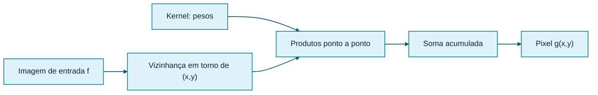

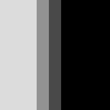

A figura torna explícita uma regra importante: o algoritmo lê a imagem de entrada e grava em outra imagem. Escrever sobre a própria entrada durante o percurso faz os resultados seguintes dependerem de valores já filtrados.

## 2. Vizinhança e conectividade

Para um pixel $p=(x,y)$, a vizinhança-4 considera os vizinhos ortogonais:

$$N_4(p)=\{(x-1,y),(x+1,y),(x,y-1),(x,y+1)\}.$$

A vizinhança diagonal é:

$$N_D(p)=\{(x-1,y-1),(x+1,y-1),(x-1,y+1),(x+1,y+1)\}.$$

A vizinhança-8 reúne as duas: $N_8(p)=N_4(p)\cup N_D(p)$. Conectividade descreve quando pixels podem formar um caminho. Ela será especialmente importante em segmentação e componentes conexos, mas já ajuda a interpretar máscaras: uma cruz 3 × 3 usa relações ortogonais; uma máscara cheia usa também diagonais.

| Conceito | Vizinhos considerados | Consequência típica |
|---|---:|---|
| 4-conectividade | 4 | diagonais isoladas não se conectam |
| 8-conectividade | 8 | diagonais podem integrar a mesma região |
| m-conectividade | combinação controlada | evita ambiguidades em alguns encontros diagonais |

Conectividade não é sinônimo de tamanho do kernel. Um kernel 3 × 3 pode atribuir peso zero às diagonais e, portanto, operar apenas sobre uma cruz.

## 3. Kernel, máscara ou filtro

Um kernel é uma pequena matriz de coeficientes que especifica a contribuição de cada posição da vizinhança. Kernels usualmente têm dimensão ímpar — 3 × 3, 5 × 5, 7 × 7 — porque assim existe um elemento central inequívoco. Para dimensão $m=2r+1$, o raio é $r=(m-1)/2$.

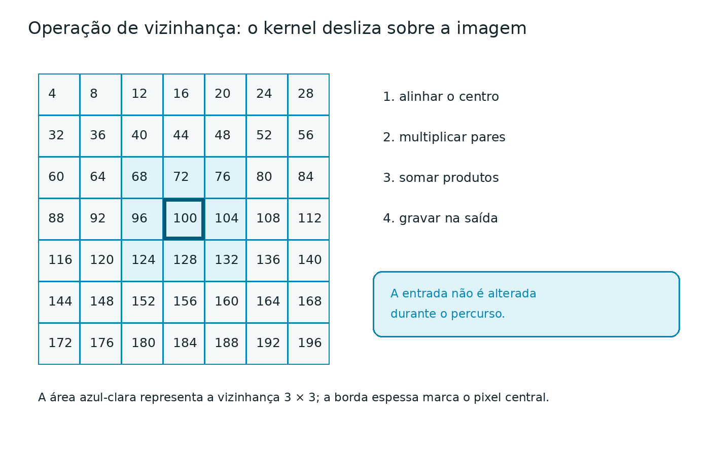

Algumas propriedades ajudam a prever o resultado:

- soma dos coeficientes igual a 1: tende a preservar o brilho médio em regiões constantes;
- soma igual a 0: anula regiões constantes e responde a variações;
- coeficientes simétricos: não privilegiam uma direção;
- coeficientes positivos e negativos: podem produzir resposta negativa;
- kernel maior: usa mais contexto e exige mais multiplicações e acessos.

Se a imagem tem $H\times W$ pixels e o kernel tem $K\times K$ coeficientes, a implementação direta custa aproximadamente $H\,W\,K^2$ multiplicações. Aumentar de 3 × 3 para 5 × 5 muda o trabalho por pixel de 9 para 25 produtos.

## 4. Correlação e convolução

Na correlação espacial, o kernel é usado na orientação em que foi escrito:

$$g(x,y)=\sum_{j=-r}^{r}\sum_{i=-r}^{r} h(i,j)\,f(x+i,y+j).$$

Na convolução matemática, o kernel é invertido horizontal e verticalmente:

$$g(x,y)=\sum_{j=-r}^{r}\sum_{i=-r}^{r} h(i,j)\,f(x-i,y-j).$$

Para kernels simétricos, como média e Gaussiano, a inversão não altera o resultado. Para Sobel, a inversão altera o sinal da resposta direcional, embora a magnitude permaneça equivalente. Muitas bibliotecas usam o nome “convolução” para uma rotina que, estritamente, calcula correlação. No relatório, indiquem a convenção adotada.

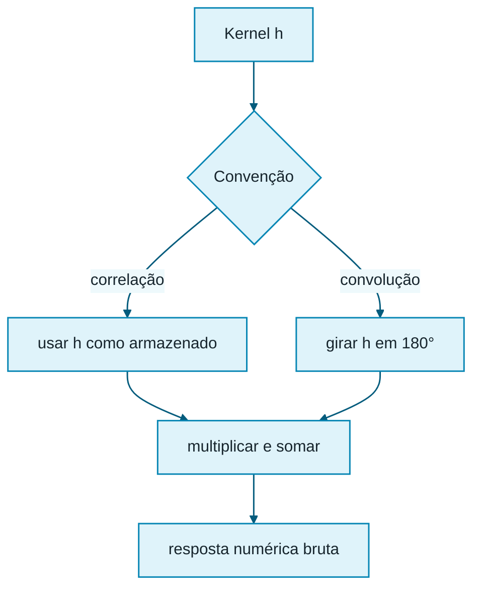

## 5. Tratamento de bordas

No interior, a vizinhança cabe integralmente. Nas bordas, parte dela aponta para coordenadas inexistentes. O M1.3 solicita duas estratégias.

### 5.1 Copiar ou ignorar

Se a vizinhança não cabe, o pixel original é copiado. A implementação é simples e preserva a moldura, mas cria uma mudança de comportamento entre interior e periferia.

### 5.2 Replicar

Uma coordenada fora dos limites é substituída pela coordenada válida mais próxima:

$$x'=\min(\max(x,0),W-1),\qquad y'=\min(\max(y,0),H-1).$$

Assim, consultar $x=-1$ equivale a consultar $x=0$; consultar $x=W$ equivale a $x=W-1$.

| Estratégia | Vantagem | Limitação |
|---|---|---|
| copiar/ignorar | simples; mantém borda original | região periférica não recebe o mesmo filtro |
| replicar | produz saída filtrada em toda a imagem | prolonga artificialmente os pixels externos |
| zero, para estudo | fácil de formular | cria contraste artificial junto às bordas |
| refletir, complementar | costuma reduzir descontinuidades | não faz parte do mínimo obrigatório |

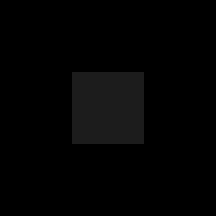

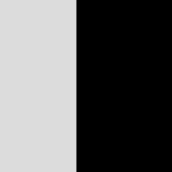

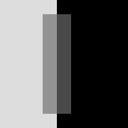

As diferenças devem se concentrar numa faixa cuja largura corresponde ao raio do kernel. Se a imagem inteira muda ao trocar a estratégia, há provável erro de índices.

## 6. Filtros de suavização

### 6.1 Média

O kernel de média 3 × 3 atribui o mesmo peso a todos os vizinhos:

$$h=\frac{1}{9}\begin{bmatrix}1&1&1\\1&1&1\\1&1&1\end{bmatrix}.$$

Ele reduz variações locais e ruído de alta frequência, mas também desfoca contornos e detalhes. A média 5 × 5 usa $1/25$ e produz suavização mais intensa.

### 6.2 Média ponderada e aproximação Gaussiana

Uma aproximação Gaussiana 3 × 3 comum é:

$$h=\frac{1}{16}\begin{bmatrix}1&2&1\\2&4&2\\1&2&1\end{bmatrix}.$$

Ela dá mais peso ao centro e reduz a influência de amostras distantes. Em uma Gaussiana contínua, o parâmetro $\sigma$ controla a dispersão; no kernel discreto, tamanho e coeficientes determinam a escala efetiva.

| Original | Média 3 × 3 | Média 5 × 5 | Gaussiano 3 × 3 |
|---|---|---|---|
|  |  | 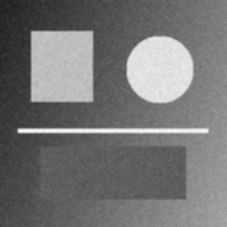 |  |

O filtro não “remove ruído” sem custo: ele troca variabilidade por perda de detalhes. A análise deve comparar regiões uniformes, bordas, linhas finas e textura.

## 7. Laplaciano e realce

O Laplaciano é uma aproximação discreta da segunda derivada:

$$\nabla^2 f=\frac{\partial^2 f}{\partial x^2}+\frac{\partial^2 f}{\partial y^2}.$$

Uma máscara de 4-vizinhos é:

$$h_L=\begin{bmatrix}0&1&0\\1&-4&1\\0&1&0\end{bmatrix}.$$

Em regiões constantes, a resposta é zero. Próximo a transições, aparecem valores positivos e negativos. Por isso, armazenar diretamente em `uint8` destrói informação: negativos podem virar zero ou sofrer conversão inadequada, e valores acima de 255 podem saturar.

Para visualizar a resposta assinada, pode-se usar deslocamento de 128 apenas na imagem de apresentação: cinza médio representa zero, tons escuros respostas negativas e tons claros respostas positivas. O vetor/matriz bruta deve continuar em tipo assinado ou ponto flutuante.

O realce combina a imagem original e a derivada. Para o kernel com centro $-4$, uma forma comum é:

$$g=f-\lambda\nabla^2 f,$$

com $\lambda>0$. O sinal deve ser coerente com a máscara escolhida. Depois da combinação, a visualização final pode ser saturada no intervalo $[0,255]$.

| Resposta Laplaciana com `+128` para visualização | Imagem realçada |
|---|---|
|  | 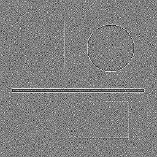 |

## 8. Gradiente e detecção de bordas com Sobel

Uma borda corresponde a uma mudança espacial de intensidade. Sobel estima as derivadas em $x$ e $y$:

$$G_x=\begin{bmatrix}-1&0&1\\-2&0&2\\-1&0&1\end{bmatrix}*f,\qquad
G_y=\begin{bmatrix}-1&-2&-1\\0&0&0\\1&2&1\end{bmatrix}*f.$$

$G_x$ responde principalmente a mudanças da esquerda para a direita, portanto destaca bordas verticais. $G_y$ responde a mudanças de cima para baixo, portanto destaca bordas horizontais.

Duas aproximações de magnitude são:

$$M_1=|G_x|+|G_y|,$$

$$M_2=\sqrt{G_x^2+G_y^2}.$$

$M_1$ evita raiz quadrada e tende a produzir valores maiores; $M_2$ corresponde à norma Euclidiana. A direção pode ser estimada por $\theta=\operatorname{atan2}(G_y,G_x)$, embora não seja exigida no contrato mínimo.

| $G_x$ | $G_y$ | $M_1$ | $M_2$ |
|---|---|---|---|
|  | 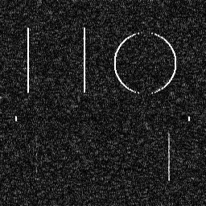 | 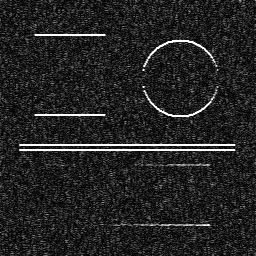 | 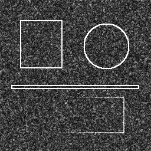 |

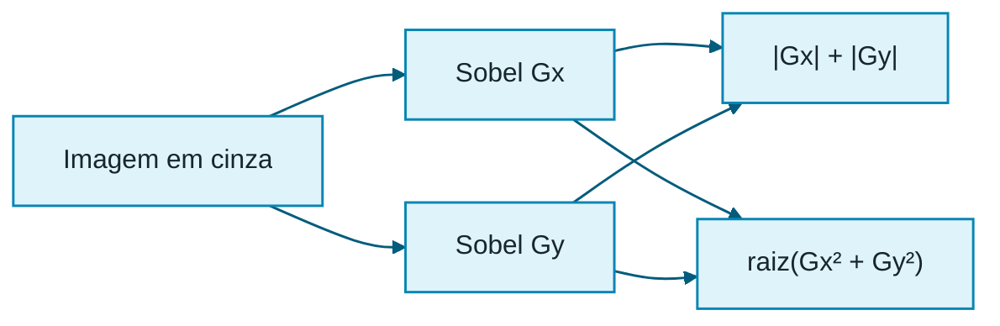

## 9. Tipos numéricos, normalização e saturação

Não existe um único “tipo correto” para todas as etapas. A entrada pode ser `uint8`, mas o acumulador deve suportar produtos, soma, negativos e valores acima de 255. Uma escolha segura é `double`/`float64` durante o cálculo.

1. leia os pixels como valores numéricos;
2. multiplique por coeficientes do kernel;
3. acumule em ponto flutuante;
4. preserve a resposta bruta quando ela tiver significado analítico;
5. somente para salvar uma imagem de 8 bits, arredonde e aplique `clamp(valor,0,255)`.

**Saturar** recorta valores; **normalizar** remapeia uma faixa para outra. Normalizar cada resultado para $[0,255]$ pode ajudar na visualização, mas impede comparações absolutas entre execuções. Documentem qual transformação foi usada.

## 10. Algoritmo genérico

```text
função filtrar(entrada, kernel, borda, inverterKernel):
    validar imagem e kernel
    raio ← tamanho(kernel) div 2
    saídaBruta ← matriz real com tamanho da entrada

    para y de 0 até altura-1:
        para x de 0 até largura-1:
            se borda = copiar e a vizinhança não cabe:
                saídaBruta[y,x] ← entrada[y,x]
                continuar

            acumulador ← 0.0
            para ky de -raio até +raio:
                para kx de -raio até +raio:
                    (sx,sy) ← coordenada de entrada segundo a borda
                    (hx,hy) ← índice do kernel
                    se inverterKernel:
                        (hx,hy) ← índices girados em 180 graus
                    acumulador ← acumulador + entrada[sy,sx] × kernel[hy,hx]
            saídaBruta[y,x] ← acumulador

    retornar saídaBruta
```

### Erros frequentes

- trocar linha/coluna por $x/y$;
- usar a saída como entrada do próximo pixel;
- calcular o raio incorretamente;
- esquecer a inversão quando a implementação declara convolução estrita;
- dividir duas vezes por 9 ou por 16;
- acumular em 8 bits;
- saturar antes de combinar o Laplaciano com a imagem;
- aplicar `abs` em $G_x$ e $G_y$ antes de registrar respostas direcionais;
- tratar bordas somente em parte dos acessos;
- confundir “borda da imagem” com “borda de um objeto”.

## 11. Implementação no `pdi_template`

O repositório oferece versões equivalentes em C++20, Java 17+ e Python 3.10+. Escolham **uma** linguagem. O contrato externo já reconhece `convolution`, `mean_filter`, `weighted_mean`, `laplacian` e `sobel`. O parsing da CLI, a validação geral, a leitura/escrita de imagens e a leitura estrutural de kernels são infraestrutura fornecida.

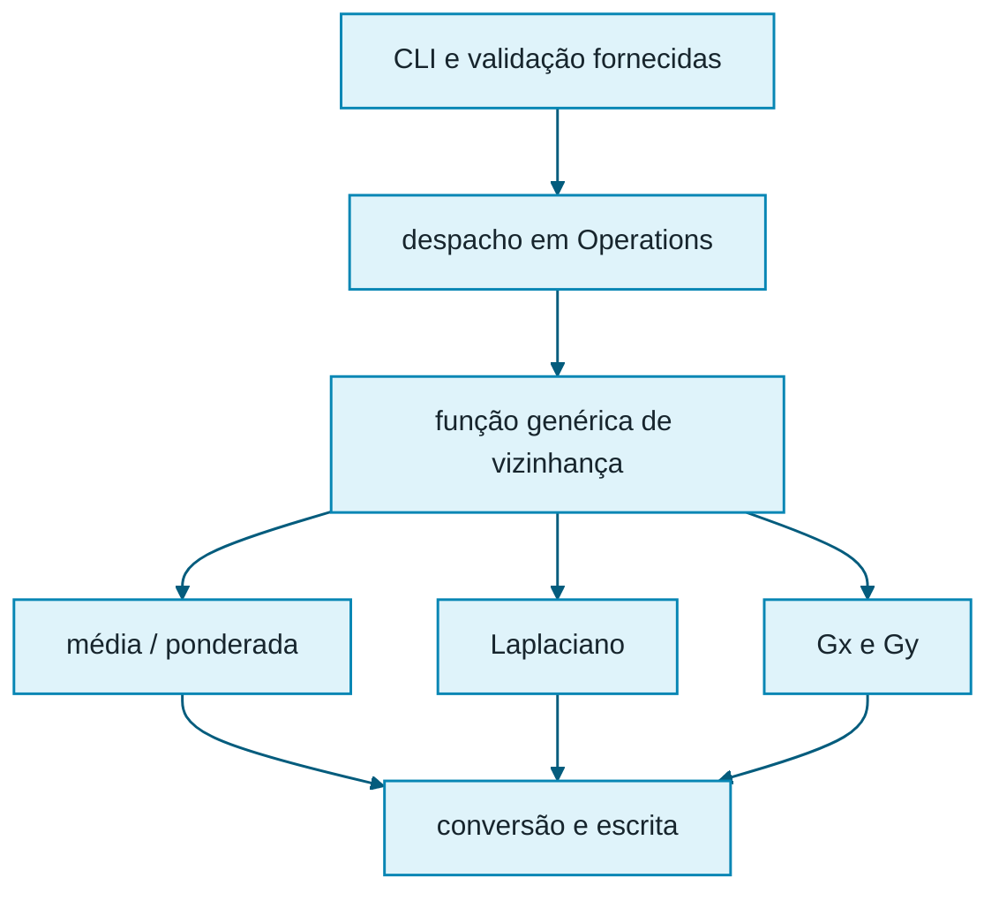

### 11.1 Sequência recomendada

1. baixem a branch `main` e escolham `cpp/`, `java/` ou `python/`;
2. executem os testes públicos antes de editar;
3. localizem `TODO(aluno)` em `operations.cpp`, `Operations.java` ou `operations.py`;
4. mantenham o método de despacho pequeno;
5. criem uma função genérica de filtragem e auxiliares para borda/saturação;
6. validem primeiro o kernel identidade;
7. testem imagem constante, impulso, degraus e objetos tocando a moldura;
8. só então executem imagens mais complexas;
9. registrem comandos, kernels, tipos, convenção e resultados no `REPORT.md`.

### 11.2 Organização sugerida por linguagem

| Linguagem | Ponto inicial existente | Organização sugerida |
|---|---|---|
| C++ | `cpp/src/operations.cpp` | funções auxiliares ou `spatial_filter.cpp/.hpp`; entrada `cv::Mat`; resposta bruta `CV_64F` |
| Java | `java/.../Operations.java` | classe `SpatialFilter`; `Mat` para entrada; `double[][]` ou `Mat` adequado para bruto |
| Python | `python/src/pdi_lab/operations.py` | módulo `spatial.py`; `numpy.ndarray`; conversão para `float64` |

Não coloquem o algoritmo em `main.cpp`, `Main.java` ou `__main__.py`. O ponto de entrada coordena; a operação deve permanecer testável separadamente.

### 11.3 Comandos do contrato

```bash
# Convolução genérica
pdi_lab --operation convolution --input images/input/test.png \
  --output images/output/conv.png --kernel kernels/identity_3x3.txt \
  --border replicate

# Média 3 × 3
pdi_lab --operation mean_filter --input images/input/test.png \
  --output images/output/media3.png --size 3 --border copy

# Sobel
pdi_lab --operation sobel --input images/input/test.png \
  --output images/output/sobel.png --border replicate
```

Adaptem apenas a forma de iniciar `pdi_lab`: executável C++, `java -jar target/pdi-lab.jar` ou `python -m pdi_lab`.

## 12. Estratégia de testes

Testes sintéticos permitem prever o resultado antes de executar.

| Caso | Propriedade esperada | Erro que ajuda a revelar |
|---|---|---|
| identidade | saída igual à entrada | índices, deslocamento, escrita |
| constante | média preserva constante; derivadas dão zero no interior | normalização e soma do kernel |
| impulso | saída reproduz a forma/orientação do kernel | correlação × convolução |
| degrau vertical | $G_x$ forte e $G_y$ pequeno | eixos trocados |
| degrau horizontal | $G_y$ forte e $G_x$ pequeno | eixos trocados |
| forma tocando borda | diferenças entre `copy` e `replicate` | acesso fora dos limites |
| kernel 5 × 5 | raio 2 e maior suavização | laços fixos em 3 × 3 |

| Impulso | Resposta da média 3 × 3 |
|---|---|
|  | 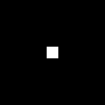 |

Para um impulso de 255 e média 3 × 3, cada uma das nove posições alcançadas deve receber aproximadamente $255/9\approx28{,}33$ antes do arredondamento.

## 13. O que comparar no mini relatório

Uma boa análise não se limita a “ficou borrado” ou “apareceram bordas”. Ela relaciona parâmetro, mecanismo e evidência:

- média 5 × 5 reduz mais a variância local porque combina 25 amostras, mas apaga linhas finas;
- Gaussiano preserva melhor o centro porque os pesos decrescem com a distância;
- replicação modifica a periferia de modo diferente de `copy` porque todos os pixels são efetivamente filtrados;
- Laplaciano bruto contém sinais opostos ao redor das transições;
- Sobel $G_x$ e $G_y$ separam orientação; magnitudes combinam respostas;
- $M_1$ e $M_2$ têm escalas diferentes e podem saturar quantidades diferentes de pixels.

Registrem a imagem de entrada, o kernel, a estratégia de borda, o tipo do acumulador, a transformação usada para visualização e um recorte ou valor numérico que sustente a conclusão.

## 14. Síntese

No domínio espacial, o algoritmo opera diretamente sobre coordenadas e intensidades. O kernel transforma uma ideia — suavizar, derivar, realçar — em pesos locais. A implementação correta depende tanto da fórmula quanto de detalhes de engenharia: entrada separada da saída, índices coerentes, bordas explícitas, acumulador adequado e conversão tardia para 8 bits. Os casos sintéticos fecham o ciclo porque permitem prever, executar, comparar e explicar.

## Referências e recursos

- GONZALEZ, Rafael C.; WOODS, Richard E. *Digital Image Processing*. 4. ed. Pearson, 2018.
- MARQUES FILHO, Ogê; VIEIRA NETO, Hugo. *Processamento Digital de Imagens*. Rio de Janeiro: Brasport, 1999.
- Projeto-base da disciplina: <https://github.com/m4rc3lo/pdi_template/tree/main>.
- OpenCV, documentação de filtragem: <https://docs.opencv.org/4.x/d4/d13/tutorial_py_filtering.html> (consulta conceitual e validação; não substitui a implementação manual exigida).

---

**Nota sobre as imagens.** As imagens deste material foram geradas a partir de uma cena sintética controlada. Isso permite observar o efeito dos filtros sem depender de fotografias externas e reproduzir as comparações.
